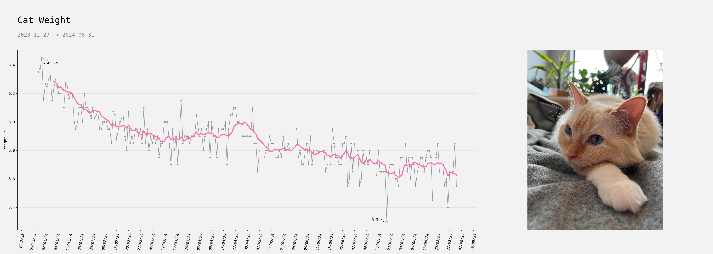
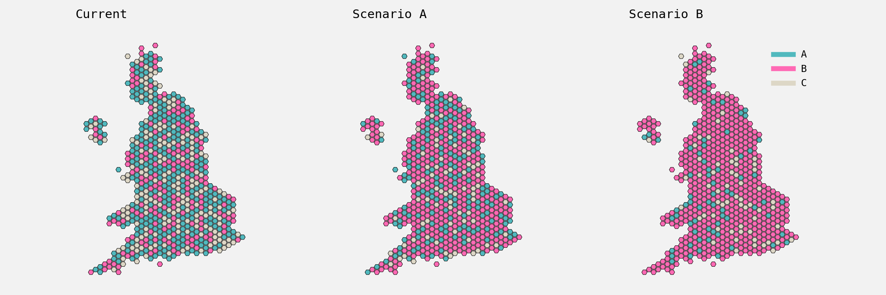

# Example plots

Example plots, typically using matplotlib. Mainly for personal use / so I have somewhere to remind
myself of some things, but if they're of any use to anyone else then ace. Code/visuals often aren't
great as they're mainly just scratch work, often copied straight over from a notebook with little
cleanup.

----

[comment]: # (Automate plots beneath this.)

# Plots

* [`bar_plot_w_custom_cmap`](https://github.com/geo7/plotting_examples?tab=readme-ov-file#bar_plot_w_custom_cmap)
* [`binary_outcome_variable`](https://github.com/geo7/plotting_examples?tab=readme-ov-file#binary_outcome_variable)
* [`box_plot_w_scatter_distributions`](https://github.com/geo7/plotting_examples?tab=readme-ov-file#box_plot_w_scatter_distributions)
* [`cat_weight`](https://github.com/geo7/plotting_examples?tab=readme-ov-file#cat_weight)
* [`line_plot_fill_between`](https://github.com/geo7/plotting_examples?tab=readme-ov-file#line_plot_fill_between)
* [`meaningless_points`](https://github.com/geo7/plotting_examples?tab=readme-ov-file#meaningless_points)
* [`opinium_barchart`](https://github.com/geo7/plotting_examples?tab=readme-ov-file#opinium_barchart)
* [`pandas_stacked_bars_with_values`](https://github.com/geo7/plotting_examples?tab=readme-ov-file#pandas_stacked_bars_with_values)
* [`pos_neg_split_hbar`](https://github.com/geo7/plotting_examples?tab=readme-ov-file#pos_neg_split_hbar)
* [`scatter_distributions`](https://github.com/geo7/plotting_examples?tab=readme-ov-file#scatter_distributions)
* [`scatter_matrix_w_kde_on_diag`](https://github.com/geo7/plotting_examples?tab=readme-ov-file#scatter_matrix_w_kde_on_diag)
* [`scatter_w_outlined_text_insert`](https://github.com/geo7/plotting_examples?tab=readme-ov-file#scatter_w_outlined_text_insert)
* [`split_x_axis_custom_legend`](https://github.com/geo7/plotting_examples?tab=readme-ov-file#split_x_axis_custom_legend)
* [`stacked_bar_with_single_bars_layout`](https://github.com/geo7/plotting_examples?tab=readme-ov-file#stacked_bar_with_single_bars_layout)
* [`uk_hexmap`](https://github.com/geo7/plotting_examples?tab=readme-ov-file#uk_hexmap)

## [`bar_plot_w_custom_cmap`](https://github.com/geo7/plotting_examples/blob/main/plotting_examples/y2022/bar_plot_w_custom_cmap/plot.py)

Bar plot with custom cmap.

Based on this tweet: https://twitter.com/ryanburge/status/1505602885215834112 - wanted
to create something with a similar effect using mpl.

Example of:

- Different font types (using monospace font)
- using different colours for bars depending on their values (custom cmap).
- padding around the axis using rc parameters

## [`binary_outcome_variable`](https://github.com/geo7/plotting_examples/blob/main/plotting_examples/y2022/binary_outcome_variable/plot.py)

Plot dichotomous variable.

Simple dots with median lines - might be nice to add a kde to this as well.

The y-axis is redundant here as there are only two options (`0.6` doesn't make any
sense).

## [`box_plot_w_scatter_distributions`](https://github.com/geo7/plotting_examples/blob/main/plotting_examples/y2022/box_plot_w_scatter_distributions/plot.py)

Bar plot with distributions.

Thought I'd create a bar plot with scatter plots of the distributions adjacent to the
bars, it was based off something else but I can't remember what. Bar plots are created
from scratch using hlines etc, for no particular reason.

Data was from tidy tuesday.

## [`cat_weight`](https://github.com/geo7/plotting_examples/blob/main/plotting_examples/y2024/cat_weight/plot.py)

Timeseries of the cats diet.

Cat was getting a little chunky towards the end of 2023 so had a resolution made for
them to lose a bit of weight. Data collection is just a daily weigh, the average of
this is taken (as there are sometimes multiple entries in a day) and then plotted along
with a ten day rolling average. Most days were covered, where there are missing days
they're imputed using the average of the days either side, eg `(a, nan, b) -> (a,
(a+b)/2, b)` though this is just a plot.

## [`line_plot_fill_between`](https://github.com/geo7/plotting_examples/blob/main/plotting_examples/y2022/line_plot_fill_between/plot.py)

Visualise time tracking, how much over/under time.

Mainly serves as an example of plotting with dates, and filling above / below
particular values on a plot.

Example of:

- plotting with dates
- different fonts
- filling between lines

## [`meaningless_points`](https://github.com/geo7/plotting_examples/blob/main/plotting_examples/y2022/meaningless_points/plot.py)

Some random points.

No real meaning to this - was messing about with some bokeh style bits (the effect, not
the python library), so dumping here. Not sure I'm mad on the output - it's also slow
as hell.

## [`opinium_barchart`](https://github.com/geo7/plotting_examples/blob/main/plotting_examples/y2022/opinium_barchart/plot.py)

Bar chart style copied from Opinium.

Saw this on twitter (i think) and thought I'd recreate it in mpl.

## [`pandas_stacked_bars_with_values`](https://github.com/geo7/plotting_examples/blob/main/plotting_examples/y2022/pandas_stacked_bars_with_values/plot.py)

Horizontal stacked bars, based off of pandas.

Could do these from scratch - pandas makes things a bit more straightforward though.

Example of:

- fixed formatting - setting categorical ticks at particular positions.

## [`pos_neg_split_hbar`](https://github.com/geo7/plotting_examples/blob/main/plotting_examples/y2022/pos_neg_split_hbar/plot.py)

Create split horizontal bar chart.

Split by dichotomous variable, with bar classifications.

Can be a bit messy - not sure I'm much of a fan - but wanted to re-create anyway.

## [`scatter_distributions`](https://github.com/geo7/plotting_examples/blob/main/plotting_examples/y2022/scatter_distributions/plot.py)

Distributions of multiple variables.

For a set of variables, each with an accompanying continuous variable on the same scale,
plot the distributions of the continuous variable. Might be useful to have a kde
overlaid here.

Example of:

- fixed formatting
- setting categorical ticks at particular positions.

## [`scatter_matrix_w_kde_on_diag`](https://github.com/geo7/plotting_examples/blob/main/plotting_examples/y2022/scatter_matrix_w_kde_on_diag/plot.py)

Scatter matrix with kde instead of histogram on the diagonal.

Could probably adapt pd.scatter_matrix instead of doing it from scratch. Though with
this approach the non-diagonal plots could be whatever instead of a scatter plot I
guess...

Would be good to make the upper diagonals differ from the lower diagonals a bit... maybe
some sort of table from pd.cut on the others or whatever.

I'd probably just use subplot_mosaic as well now - that's grown on me a lot since this.

## [`scatter_w_outlined_text_insert`](https://github.com/geo7/plotting_examples/blob/main/plotting_examples/y2022/scatter_w_outlined_text_insert/plot.py)

Scatter plot with text inserted to scatter points.

Data was taken from a tidy tuesday.

Example of:

- Outlining text elements in a plot.

## [`split_x_axis_custom_legend`](https://github.com/geo7/plotting_examples/blob/main/plotting_examples/y2022/split_x_axis_custom_legend/plot.py)

Example of creating multiple x-axis in order to plot year / months.

The fig size needs to be pretty large in order to squeeze all the month names etc in
here. Generated data looks a mess on these plots.

Example of:

- Custom legend
- generating random date data
- multiple x-axis to display years / months

## [`stacked_bar_with_single_bars_layout`](https://github.com/geo7/plotting_examples/blob/main/plotting_examples/y2022/stacked_bar_with_single_bars_layout/plot.py)

Layout containing two bar plots and a bivariate plot between them.

In this case it's a silly example of some data containing the social grade of
Labradors, as well as the education group. The main plot is a stacked bar containing
the breakdown of education group for each social grade.

Don't think I'm too keen on the code for this plot - though it's not always so clear
(to me) how to make "nice" code with a lot of matplotlib stuff.

Obviously, the data is made up.

## [`uk_hexmap`](https://github.com/geo7/plotting_examples/blob/main/plotting_examples/y2022/uk_hexmap/plot.py)

Hex map for the UK constituencies.

Some meaningless generated data - small multiples with hex maps can be useful sometimes
though. Could be good to add in the geographically accurate version as well.

