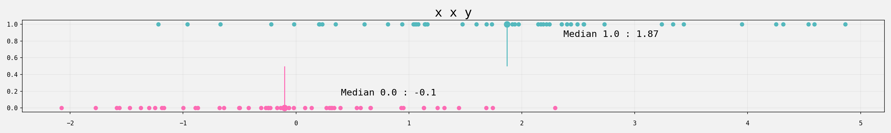
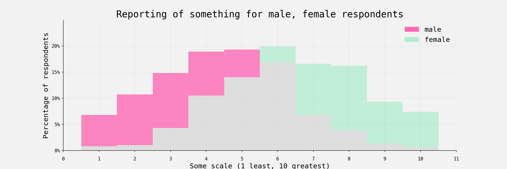
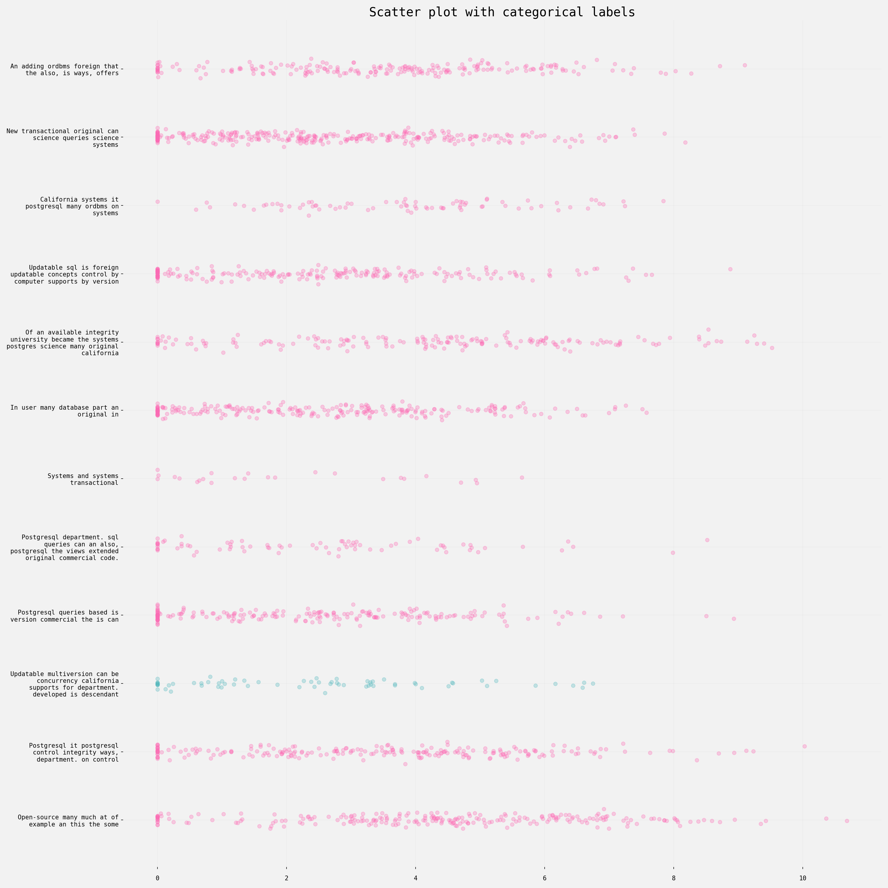
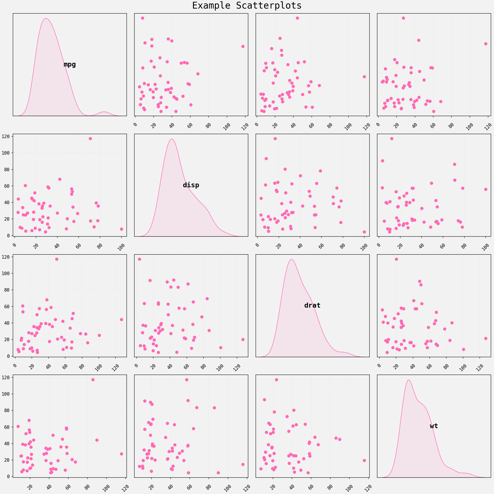
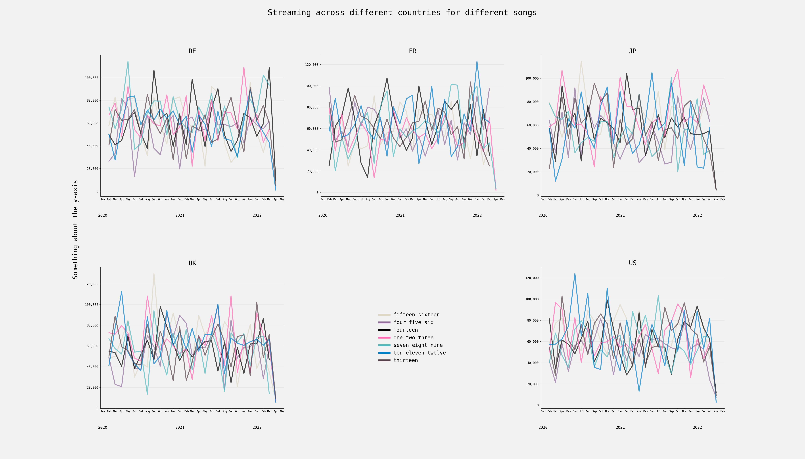

# Example plots

Example plots, typically using matplotlib. Mainly for personal use / so I have somewhere to remind
myself of some things, but if they're of any use to anyone else then ace. Code/visuals often aren't
great as they're mainly just scratch work, often copied straight over from a notebook with little
cleanup.

----

[comment]: # (Automate plots beneath this.)

# Plots

* [`bar_plot_w_custom_cmap`](https://github.com/geo7/plotting_examples#bar_plot_w_custom_cmap)
* [`binary_outcome_variable`](https://github.com/geo7/plotting_examples#binary_outcome_variable)
* [`box_plot_w_scatter_distributions`](https://github.com/geo7/plotting_examples#box_plot_w_scatter_distributions)
* [`histogram_with_two_variables`](https://github.com/geo7/plotting_examples#histogram_with_two_variables)
* [`line_plot_fill_between`](https://github.com/geo7/plotting_examples#line_plot_fill_between)
* [`opinium_barchart`](https://github.com/geo7/plotting_examples#opinium_barchart)
* [`pandas_stacked_bars_with_values`](https://github.com/geo7/plotting_examples#pandas_stacked_bars_with_values)
* [`pos_neg_split_hbar`](https://github.com/geo7/plotting_examples#pos_neg_split_hbar)
* [`scatter_distributions`](https://github.com/geo7/plotting_examples#scatter_distributions)
* [`scatter_matrix_w_kde_on_diag`](https://github.com/geo7/plotting_examples#scatter_matrix_w_kde_on_diag)
* [`scatter_w_outlined_text_insert`](https://github.com/geo7/plotting_examples#scatter_w_outlined_text_insert)
* [`sns_violin_plot_custom`](https://github.com/geo7/plotting_examples#sns_violin_plot_custom)
* [`split_x_axis_custom_legend`](https://github.com/geo7/plotting_examples#split_x_axis_custom_legend)
* [`uk_hexmap`](https://github.com/geo7/plotting_examples#uk_hexmap)

## [`bar_plot_w_custom_cmap`](https://github.com/geo7/plotting_examples/blob/master/plotting_examples/y2022/bar_plot_w_custom_cmap/plot.py)

Bar plot with custom cmap.

Based on this tweet: https://twitter.com/ryanburge/status/1505602885215834112 - wanted to create
something with a similar effect using mpl.

Example of:

- Different font types (using monospace font)
- using different colours for bars depending on their values (custom cmap).
- padding around the axis using rc parameters

## [`binary_outcome_variable`](https://github.com/geo7/plotting_examples/blob/master/plotting_examples/y2022/binary_outcome_variable/plot.py)

Plot dichotomous variable.

Simple dots with median lines - might be nice to add a kde to this as well.

## [`box_plot_w_scatter_distributions`](https://github.com/geo7/plotting_examples/blob/master/plotting_examples/y2022/box_plot_w_scatter_distributions/plot.py)

Bar plot with distributions.

Thought I'd create a bar plot with scatter plots of the distributions adjacent to the bars, it was
based off something else but I can't remember what. Bar plots are created from scratch using hlines
etc, for no particular reason.

Data was from tidy tuesday.

## [`histogram_with_two_variables`](https://github.com/geo7/plotting_examples/blob/master/plotting_examples/y2022/histogram_with_two_variables/plot.py)

Histogram created from scratch using matplotlib.

There are custom bar's created for each bin, instead of using ax.bar, I think it was originally
based on something but i can't find the original / reference now so am just left with this.

The result is pretty rubbish :)

## [`line_plot_fill_between`](https://github.com/geo7/plotting_examples/blob/master/plotting_examples/y2022/line_plot_fill_between/plot.py)

Visualise time tracking, how much over/under time.

Mainly serves as an example of plotting with dates, and filling above / below particular values on a
plot.

Example of:

- plotting with dates
- different fonts
- filling between lines

## [`opinium_barchart`](https://github.com/geo7/plotting_examples/blob/master/plotting_examples/y2022/opinium_barchart/plot.py)

Bar chart style copied from Opinium.

Saw this on twitter (i think) and thought I'd recreate it in mpl.

## [`pandas_stacked_bars_with_values`](https://github.com/geo7/plotting_examples/blob/master/plotting_examples/y2022/pandas_stacked_bars_with_values/plot.py)

Horizontal stacked bars, based off of pandas.

Could do these from scratch - pandas makes things a bit more straightforward though.

Example of:

- fixed formatting - setting categorical ticks at particular positions.

## [`pos_neg_split_hbar`](https://github.com/geo7/plotting_examples/blob/master/plotting_examples/y2022/pos_neg_split_hbar/plot.py)

Create split horizontal bar chart, split by dichotomous variable, with bar classifications.

Can be a bit messy - not sure I'm much of a fan - but wanted to re-create anyway.

## [`scatter_distributions`](https://github.com/geo7/plotting_examples/blob/master/plotting_examples/y2022/scatter_distributions/plot.py)

Distributions of multiple variables.

For a set of variables, each with an accompanying continuous variable on the same scale, plot the
distributions of the continuous variable. Might be useful to have a kde overlaid here.

Example of:

- fixed formatting
- setting categorical ticks at particular positions.

## [`scatter_matrix_w_kde_on_diag`](https://github.com/geo7/plotting_examples/blob/master/plotting_examples/y2022/scatter_matrix_w_kde_on_diag/plot.py)

Scatter matrix with kde instead of histogram on the diagonal.

Could probably adapt pd.scatter_matrix instead of doing it from scratch. Though with this approach
the non-diagonal plots could be whatever instead of a scatter plot I guess...

## [`scatter_w_outlined_text_insert`](https://github.com/geo7/plotting_examples/blob/master/plotting_examples/y2022/scatter_w_outlined_text_insert/plot.py)

Scatter plot with text inserted to scatter points.

Data was taken from a tidy tuesday.

Example of:

- Outlining text elements in a plot.

## [`sns_violin_plot_custom`](https://github.com/geo7/plotting_examples/blob/master/plotting_examples/y2022/sns_violin_plot_custom/plot.py)

Edit SNS violin plot.

Simple example of adjusting the output of a sns plot - I don't typically use sns, but ofc the
objects can be accessed/iterated/edited over as with any other mpl axis.

What's here doesn't look good - just an example of changing defaults.

## [`split_x_axis_custom_legend`](https://github.com/geo7/plotting_examples/blob/master/plotting_examples/y2022/split_x_axis_custom_legend/plot.py)

Example of creating multiple x-axis in order to plot year / months.

The fig size needs to be pretty large in order to squeeze all the month names etc in here. Generated
data looks a mess on these plots.

Example of:

- Custom legend
- generating random date data
- multiple x-axis to display years / months

## [`uk_hexmap`](https://github.com/geo7/plotting_examples/blob/master/plotting_examples/y2022/uk_hexmap/plot.py)

Hex map for the UK constituencies.

Some meaningless generated data - small multiples with hex maps can be useful sometimes though.
Could be good to add in the geographically accurate version as well.

